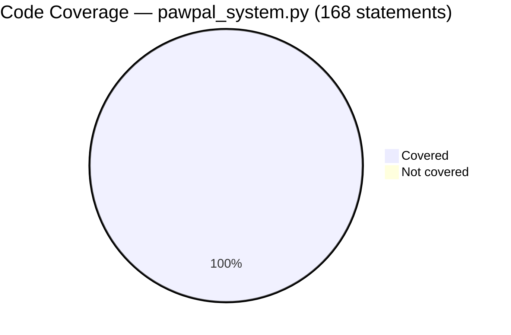
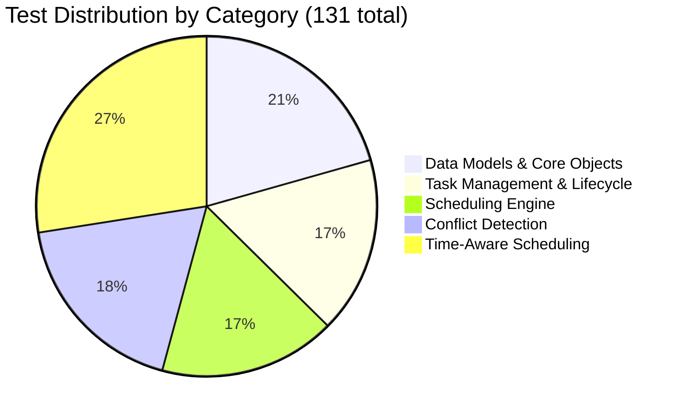
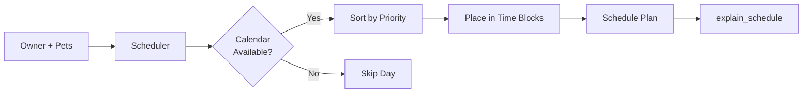
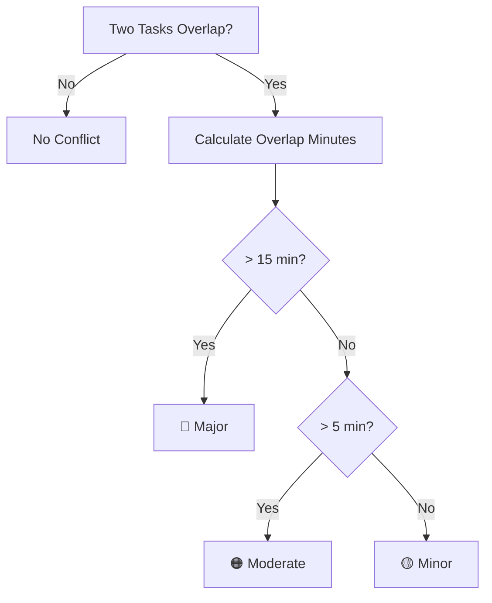
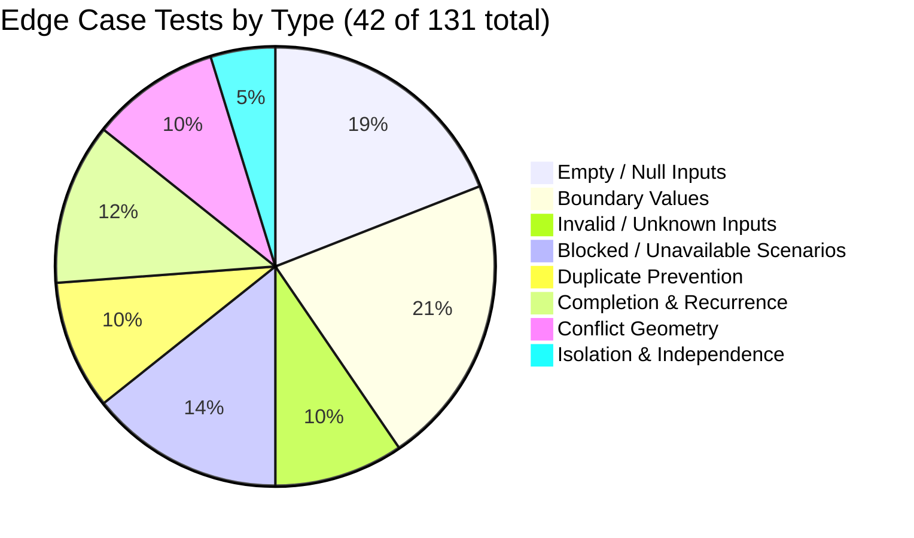

# PawPal+ (Module 2 Project)

You are building **PawPal+**, a Streamlit app that helps a pet owner plan care tasks for their pet.

## Scenario

A busy pet owner needs help staying consistent with pet care. They want an assistant that can:

- Track pet care tasks (walks, feeding, meds, enrichment, grooming, etc.)
- Consider constraints (time available, priority, owner preferences)
- Produce a daily plan and explain why it chose that plan

Your job is to design the system first (UML), then implement the logic in Python, then connect it to the Streamlit UI.

## What you will build

Your final app should:

- Let a user enter basic owner + pet info
- Let a user add/edit tasks (duration + priority at minimum)
- Generate a daily schedule/plan based on constraints and priorities
- Display the plan clearly (and ideally explain the reasoning)
- Include tests for the most important scheduling behaviors

## Smarter Scheduling

PawPal+ goes beyond a simple task list — it actively detects and helps resolve scheduling conflicts so your pet care plan is always realistic.

### Conflict Detection

Every day in the 7-day schedule is scanned for overlapping task windows. Two tasks conflict when their assigned time ranges overlap (i.e. one starts before the other ends). Conflicts are classified by severity based on how much time overlaps:

| Severity | Overlap | Indicator |
|----------|---------|-----------|
| Minor    | 1–5 min | 🟡 Yellow |
| Moderate | 6–15 min | 🟠 Orange |
| Major    | > 15 min | 🔴 Red |

### Conflict UI

When conflicts are found for a day, a **color-coded summary banner** appears immediately — no need to dig through the schedule to notice a problem. For each conflict, the detail panel shows:

- **Side-by-side task cards** with time range and priority for both tasks
- **Visual timeline bar** — blue and green blocks for each task, with the overlap highlighted in red, all scaled proportionally to the available time window
- **Priority-aware suggestion** — automatically identifies which task has the lower priority and recommends shortening it to eliminate the overlap
- **Auto-fix button** — one click applies the recommended fix instantly
- **Manual override inputs** — adjust either task's duration to any value if you prefer a custom resolution

The expander auto-opens for Major and Moderate conflicts so critical issues are never missed, and stays collapsed for Minor ones to keep the view clean.

### Time-Aware Scheduling

Tasks are distributed across the owner's free time blocks for each day:

- **Single-occurrence tasks** are stacked sequentially from the start of the first free block, automatically advancing to the next block if a task would overflow.
- **Multi-occurrence tasks** (e.g. feeding 3×/day) are spread evenly across all free blocks, with each occurrence centered within its sub-interval.
- **Busy windows** (e.g. work hours) are respected — tasks are only placed in the gaps before and after the busy period.

## Testing PawPal+

The test suite lives in [`tests/test_pawpal.py`](tests/test_pawpal.py) and provides comprehensive coverage of the core scheduling engine, conflict detection, and domain model — **131 tests, all passing**.

---

### Running the Tests

```bash
# Activate your virtual environment first
source .venv/bin/activate        # Windows: .venv\Scripts\activate

# Run all tests
python -m pytest

# Run with detailed output
python -m pytest -v

# Run a specific category
python -m pytest -v -k "Conflict"
```

**Last run result:**

```
131 passed, 1 warning in 0.32s
```

To also generate a coverage report:

```bash
pip install pytest-cov
python -m pytest --cov=pawpal_system --cov-report=term-missing
```

---

### Code Coverage

The test suite is run against `pawpal_system.py` — the entire backend logic layer — using `pytest-cov`.

| Module | Statements | Missed | Coverage |
|---|:---:|:---:|:---:|
| `pawpal_system.py` | 168 | 0 | **100%** |
| **Total** | **168** | **0** | **100%** |



> **Note:** Coverage measures `pawpal_system.py` only. The Streamlit UI (`app.py`) is not included in the automated test run.

---

### Test Coverage at a Glance

The 131 tests are organized into **5 functional categories**, each targeting a distinct layer of the system.



---

### Category Breakdown

#### 1. Data Models & Core Objects — 25 tests

Validates that every domain object is constructed correctly, exposes the right data, and maintains accurate relationships between entities.

| Test Class | Tests | What Is Verified |
|---|:---:|---|
| `TestTask` | 2 | Field values, string representation |
| `TestTimeSlot` | 1 | String representation |
| `TestEvent` | 1 | String representation |
| `TestCalendar` | 5 | Adding events, holiday blocking, availability queries, unavailable-time retrieval |
| `TestPet` | 7 | Pet info, care requirements, species-based schedule preferences, owner linkage |
| `TestOwner` | 9 | Owner info, bidirectional pet linking, duplicate prevention, shared-pet multi-owner scenarios |

---

#### 2. Task Management & Lifecycle — 19 tests

Covers the full lifecycle of a task: creation, editing, removal, completion, reminders, and the `active_from` gate that controls when a task first becomes active.

| Test Class | Tests | What Is Verified |
|---|:---:|---|
| `TestTracker` | 14 | Add / remove / edit tasks, deduplication, daily / weekly / monthly frequency filtering, completion logging, upcoming-task countdown, reminder output |
| `TestTrackerActiveFrom` | 5 | Task hidden before `active_from`; visible on and after the activation date (daily and weekly variants) |

---

#### 3. Scheduling Engine — 20 tests

End-to-end tests of the `Scheduler` class, including day ordering, recurrence behavior, and the natural-language explanation output.

| Test Class | Tests | What Is Verified |
|---|:---:|---|
| `TestScheduler` | 9 | Schedule generation, daily task inclusion, unavailable-day skipping, priority-based task ordering, `explain_schedule` content |
| `TestChronologicalOrdering` | 5 | Plan days in ascending order, only future/today dates included, 7-day window enforced, explanation output ordered |
| `TestRecurrenceLogic` | 6 | Completed task reappears the next cycle, `active_from` advances correctly after completion, priority and duration preserved on rescheduling |



---

#### 4. Conflict Detection — 22 tests

Verifies the overlap-detection algorithm and severity classifier across all boundary conditions, plus integration tests that confirm the `Scheduler` surfaces conflicts correctly.

| Test Class | Tests | What Is Verified |
|---|:---:|---|
| `TestDetectConflicts` | 9 | No-conflict cases (empty, single, sequential, gap), partial overlap, identical slots, full containment, three-slot multi-pair scenarios |
| `TestConflictSeverity` | 8 | Boundary values for Minor / Moderate / Major thresholds, correct emoji and color codes returned |
| `TestSchedulerConflictDetection` | 5 | Scheduler flags duplicate start times, names both conflicting tasks, does not flag sequential tasks, catches all overlapping pairs |



---

#### 5. Time-Aware Scheduling — 23 tests

Tests the logic that places tasks within free time blocks, respects busy periods, and distributes multi-occurrence tasks evenly across the day.

| Test Class | Tests | What Is Verified |
|---|:---:|---|
| `TestTasksDueOnFiltering` | 7 | Daily / weekly / monthly tasks filtered to correct days, multi-pet scenarios, empty edge cases |
| `TestTasksDueOnSorting` | 3 | High → Medium → Low priority order, unknown priorities sort last |
| `TestTimesPerDay` | 7 | Correct slot count per occurrence, distinct start times, even spread across free blocks, chronological ordering, task name preserved |
| `TestBusyTimeExclusion` | 6 | No slots when fully busy, task placed inside a free block, tasks avoid the busy window, multi-occurrence and multi-pet tasks all respect free blocks, overflow advances to the next block |

---

### Edge Case Coverage

Of the 131 total tests, **42 explicitly target edge and boundary conditions** (~32%). These are grouped into 8 categories:



| Edge Case Category | Count | Representative Tests |
|---|:---:|---|
| **Empty / Null Inputs** | 8 | No pets, no tasks, empty conflict list, empty schedule, empty care requirements, empty owner list |
| **Boundary Values** | 9 | Conflict severity at exactly 5, 6, and 15 minutes; `active_from` on the exact activation date; 7-day window boundary |
| **Invalid / Unknown Inputs** | 4 | Unknown priority level (`"urgent"`), editing a non-existent task, removing an absent task |
| **Blocked / Unavailable Scenarios** | 6 | No free time blocks, fully busy calendar day, holiday blocking, task not placed during busy window, overflow to next block |
| **Duplicate Prevention** | 4 | Adding the same task twice, adding the same pet twice, duplicate owner–pet links |
| **Completion & Recurrence** | 5 | Completed task absent on same day, reappears next cycle, monthly task unchanged, log identity mismatch |
| **Conflict Geometry** | 4 | Identical start/end times, complete containment, sequential (touching) slots, gap between slots |
| **Isolation & Independence** | 2 | Blocking one owner's calendar does not affect another's; completion log keyed by object identity |

> Tests were identified as edge cases when their name or assertion explicitly targets a boundary, invalid input, empty state, or non-obvious behavior rather than a normal happy-path flow.

---

### Confidence Level

```
★★★★☆  4 / 5
```

**Strengths:** The entire backend (`pawpal_system.py`) is covered at **100%** — all 168 statements are exercised. The 131 tests span 5 functional layers with 42 dedicated edge and boundary cases covering empty inputs, unknown values, duplicate prevention, conflict geometry, recurrence logic, and time-block overflow.

**Gap:** The Streamlit UI layer (`app.py`) and AI-assisted explanation features are not covered by automated tests, leaving the user-facing surface unverified. Adding integration or snapshot tests for the UI would push this to 5 stars.

---

## Getting started

### Setup

```bash
python -m venv .venv
source .venv/bin/activate  # Windows: .venv\Scripts\activate
pip install -r requirements.txt
```

### Suggested workflow

1. Read the scenario carefully and identify requirements and edge cases.
2. Draft a UML diagram (classes, attributes, methods, relationships).
3. Convert UML into Python class stubs (no logic yet).
4. Implement scheduling logic in small increments.
5. Add tests to verify key behaviors.
6. Connect your logic to the Streamlit UI in `app.py`.
7. Refine UML so it matches what you actually built.
